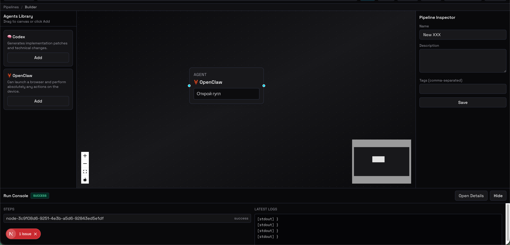

# Kovalsky

Run an AI team with a single prompt.

Kovalsky is an open-source platform for building and running AI employees.

Each AI agent behaves like a team member with a role and responsibilities.
Users coordinate these agents using workflows.

Instead of interacting with a single AI assistant, Kovalsky allows you to manage a team of specialized AI agents working together to complete complex tasks.

<p align="center">

<a href="https://github.com/hiddenway/kovalsky/releases">Download</a> •
<a href="https://github.com/hiddenway/kovalsky/discussions">Community</a>

</p>

## Pipeline Builder UI



## The Idea

Most AI tools work like this:

User -> AI -> Response

Kovalsky introduces a different model:

User -> Workflow -> AI Agents -> Result

Each agent behaves like a specialized employee:

- Developer
- Researcher
- QA tester
- DevOps engineer
- Analyst

Users define how these agents collaborate using workflows.

## Example Workflow

Example workflow for building a simple application:

User request
     ↓
Research Agent
     ↓
Developer Agent
     ↓
Testing Agent
     ↓
Deployment Agent

Each agent performs its task and passes context to the next one.

This allows AI systems to solve complex multi-step problems.

## Core Concepts

### Agents (AI Employees)

Agents are autonomous AI workers responsible for performing tasks.

Each agent has:

- role — what the agent is responsible for
- goal — what the agent tries to achieve
- execution environment — where the agent runs

Example roles:

- software engineer
- QA tester
- research analyst
- DevOps engineer

### Direct Communication

You can communicate with each agent individually.

Like with human teammates, you can:

- ask an agent to clarify its work
- adjust instructions
- refine results
- correct mistakes

This gives fine-grained control over a workflow.

### Workflows

Workflows define how agents collaborate.

A workflow is a sequence (or graph) of agents that execute tasks step by step.

Example:

Research -> Development -> Testing -> Deployment

Each agent receives context from previous steps and continues the task.

### Execution Model

Workflows are controlled by the user.

Users can:

- run agents manually
- execute workflows
- pass context between agents
- communicate with specific agents
- monitor execution results

## Architecture

The architecture is intentionally simple:

User
 |
 v
Workflow
 |
 v
Agents
 |
 v
Execution

Agents perform tasks and return results back to the workflow.

## Why Kovalsky is Different

Many AI agent frameworks focus on autonomous orchestration where agents run automatically with minimal user control.

Kovalsky takes a different approach.

Instead of hiding the process, Kovalsky allows you to work directly with your AI team.

- Human-like collaboration: you interact with agents like team members.
- Direct control: you can step in at any point and guide a specific agent.
- Workflow-driven: tasks are divided between specialized agents.
- Simple architecture: workflows coordinate agents without heavy orchestration layers.

## Example Agent Definition

```json
{
  "name": "developer-agent",
  "role": "AI software engineer",
  "goal": "implement features requested in the workflow"
}
```

## Example Workflow Definition

```json
{
  "workflow": [
    "research-agent",
    "developer-agent",
    "test-agent",
    "deploy-agent"
  ]
}
```

## Installation

### Download Prebuilt Release

You can download a prebuilt version from:

[https://github.com/hiddenway/kovalsky/releases](https://github.com/hiddenway/kovalsky/releases)

### Build and Run from Source

Clone and install:

```bash
git clone https://github.com/hiddenway/kovalsky.git
cd kovalsky
nvm use node
pnpm install
```

Run backend (terminal #1):

```bash
nvm use node
pnpm run dev
```

Run UI (terminal #2):

```bash
nvm use node
pnpm --dir ui run dev
```

Open:

- `http://localhost:3000/pipelines`

Notes:

- Backend default URL: `http://127.0.0.1:8787`
- If a workflow has no workspace, opening it from Workflows page requires choosing a workspace first.
- If you switch Node versions and get `better-sqlite3` ABI errors, run:

```bash
nvm use node
pnpm rebuild better-sqlite3
```

## Desktop (Electron)

Local desktop run from source:

```bash
nvm use node
pnpm run electron:dev
```

Build distributables:

```bash
nvm use node
./build.sh
```

Quick package (zip only):

```bash
nvm use node
./build.sh --quick
```

Build artifacts are written to `release/`.

## Use Cases

### AI Development Team

Agents:

- architect
- developer
- tester
- deployer

Task:

Build and deploy a web application.

### Content Production

Agents:

- researcher
- writer
- editor
- publisher

Task:

Research and publish a blog article.

### Data Analysis

Agents:

- data collector
- analyst
- report generator

Task:

Analyze company data and produce insights.

## Contributing

Contributions are welcome.

You can contribute by:

- creating new agents
- building workflows
- improving architecture
- improving documentation
- reporting bugs

## License

Kovalsky is source-available software licensed under the
Functional Source License (FSL-1.1-Apache-2.0).

You may use, modify, and self-host the software.

Offering Kovalsky as a competing commercial hosted service is not permitted
until two years after the version is released, at which point the code
becomes available under the Apache License 2.0.

## Community

Join discussions:

[https://github.com/hiddenway/kovalsky/discussions](https://github.com/hiddenway/kovalsky/discussions)
